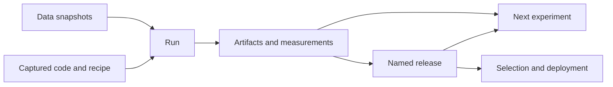

# Architecture

OpenFoundry turns an evolving model project into durable, usable model versions.
The unit of work is a run; the product is a model with enough recorded context
to evaluate it, reproduce it, extend it, and use it. Agents own development
strategy. The factory owns the history and execution of that work.

## The loop

1. Admission pins data revisions, source bytes, parameters, dependency locks,
   and executor requirements before work starts.
2. A durable operation executes the admitted stage graph. Recovery resumes
   that same work from receipts and recorded results.
3. Results bind artifacts and measurements to their exact inputs. Comparisons
   expose changes in the model and the measurement protocol.
4. A release preserves a model version and its evidence. Saving a failed
   candidate is useful history, so quality thresholds do not gate preservation.
5. Selection moves an alias atomically. Selection and deployment verify the
   release and check current rights and project requirements. Evaluation must
   pass by default; compatibility and vulnerability scans are project options.

## Owners

`Factory` is the application boundary shared by Python, CLI, and HTTP. Services
share its database, stores, identity, policy, and executor registry.

| Owner | Responsibility |
| --- | --- |
| `experiment_definition.py`, `experiments.py` | Compile ordinary scripts into runs; search sweeps, ranked review, reproduce, and export their results |
| `script_runner.py` | Standalone standard-library script adapter, captured with source |
| `factory.py`, `run_support.py`, `run_control.py` | Admission, stage execution, durable recovery, cancellation, and result publication |
| `evaluation.py`, `candidate_review.py` | Measurement, compatibility checks, comparisons, and reports |
| `publishing.py`, `releases.py` | Signed model versions and atomic alias movement |
| `deployments.py` | Serving admission, worker attachment, status, cancellation, and rollback |
| `data.py`, `artifacts.py`, `stores/`, `sync.py` | Snapshots, content-addressed payloads, verified restoration, and transfer |
| `database.py`, `events.py`, `lineage.py`, `operations.py` | Immutable history, signed events, dependencies, and mutable execution status |
| `policy.py`, `security.py` | Project authorization and requirements, signing, secrets, and scoped tokens |
| `actions.py`, `cli.py`, `api.py`, `agent.py` | Shared command/route definitions, attributed interfaces, and bounded factory views |
| `config.py`, `install_support.py`, `backups.py` | Project setup and verified state movement |

`canonical.py`, `models.py`, and `schema_registry.py` define resource identity
and serialization. A revision hashes the resource's identity and spec; changing
status does not change it. `schemas/` contains the accepted authored formats.
Generic goals, agent memory, recommendation engines, and approval labels have
no runtime role and are outside the product.

## Runtime boundaries

A `WorkloadSpec` describes a graph of modules; a `Binding` describes placement
and resource limits. `ModelPackage` and `EvaluationSpec` describe interfaces
and measurements. These resources remain neutral to model architecture,
modality, framework, and provider.

`executors/registry.py` resolves providers by exact name and validates their
capabilities. `executors/local.py` runs process groups with POSIX limits and
Linux network isolation. Its cached dependency environments include the lock,
interpreter, inherited package inventory, and options in their identity.
`local_worker.py` rechecks attested executables before launch and records
completion. `run_worker.py` and `serve_worker.py` detach control and inference
from the caller's session. See [executors](executors.md) for the plugin contract.

Git holds code and configuration; stores hold data and models; `.openfoundry/` holds
untracked runtime state. Uncommitted source is captured by default. Captured
bytes and exact resource references, rather than a mutable checkout or alias,
determine admitted work and release contents.

## Invariants

- Revisions and payload digests are immutable. Recovery and reproduction never
  silently substitute current data, source, or evaluation semantics.
- Events and their state mutations commit together. Alias comparison and update
  occur in the same transaction. Status transitions retain their version guards.
- Dataset rights are checked for actual training/evaluation use. Alias movement
  and deployment launch recheck current rights under revocation locks. Deployment
  revisions pin an exact release so rollback preserves the selected model.
- Unknown or incapable executors fail before allocation. No implicit local fallback.
- Secrets and operation/event payloads stay out of bounded agent views. Incremental
  cursors preserve progress without skipping omitted events.
- A scanner report is imported evidence. OpenFoundry does not invent a scan, reviewer,
  SBOM, deployment compatibility, or rollback guarantee.

OpenFoundry 2 uses `openfoundry.release/v2` manifests and action catalog version 2. Earlier run
and data history remains readable; recreate releases from recorded runs for
new promotion and deployment. See [operations](operations.md) for upgrade steps.
